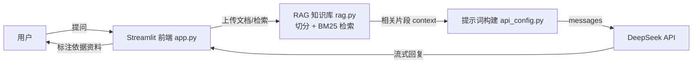

# AI 智能问答系统（Streamlit + DeepSeek + RAG）

一个基于 **Streamlit** 与 **DeepSeek API** 的 AI 应用项目，支持多模型切换、流式输出、数学公式渲染、多轮上下文记忆，并内置 **RAG 知识库问答** 与 **答案溯源**。

## 功能亮点

- 💬 多轮对话：AI 能记住最近若干轮上下文
- ⚡ 真·流式输出：边生成边显示
- 🧠 多模型切换：DeepSeek Chat / DeepSeek Reasoner
- 📐 数学公式渲染：LaTeX 自动显示为漂亮分数
- 📚 RAG 知识库：上传文档，AI 依据文档内容回答
- 🧷 答案溯源：引用资料时标注「（依据资料1）」来源，降低幻觉
- 🎛 参数可调：Temperature、Max Tokens、记忆轮数
- 🔧 工程化：API Key 走环境变量、模块化设计

## 系统架构



## 环境要求

- Python 3.9+
- DeepSeek API Key（环境变量 `DEEPSEEK_API_KEY`）

## 安装依赖

```bash
.venv\Scripts\activate
pip install -r requirements.txt
```

## 配置 API Key

Windows PowerShell（临时，仅当前窗口生效）：
```powershell
$env:DEEPSEEK_API_KEY="sk-你的密钥"
```

也可以写入系统环境变量，长期生效。

## 本地运行

```bash
streamlit run app.py
```

浏览器打开 `http://localhost:8501`。

## 使用 RAG 知识库

1. 左侧「📚 知识库」区域上传 **txt / md / pdf** 文档
2. 提问时，系统会自动检索与问题最相关的片段并注入提示词
3. AI 会优先依据你上传的文档内容回答，并在引用时标注来源

> 说明：当前检索器为 BM25（稀疏向量），纯 Python 实现、轻量易部署；代码已抽象为 `rag.SimpleRAG`，可平滑替换为 ChromaDB + Embedding 的稠密向量检索。

## 部署到 Streamlit Cloud（免费）

1. 把代码提交并推送到 GitHub：
   ```bash
   git add -A
   git commit -m "feat: 答案溯源与架构文档"
   git push origin main
   ```
2. 登录 [share.streamlit.io](https://share.streamlit.io)，点击 **New app**
3. 选择仓库 `moonverse-bot/simple-demos`、分支 `main`，入口文件填 `app.py`
4. 在 **Advanced settings → Secrets** 里添加：
   ```
   DEEPSEEK_API_KEY = sk-你的密钥
   ```
5. 点击 **Deploy**，等待构建完成即可获得公网访问链接

## 项目结构

```
simple-demos/
├── app.py            # Streamlit 界面与交互（入口）
├── api_config.py     # 模型调用、消息构建、公式渲染
├── rag.py            # 文档切分 + BM25 检索（RAG）
├── requirements.txt  # 依赖清单
└── README.md
```

## 说明

- 切换到推理模型 `deepseek-reasoner` 时，`Temperature` 参数无效（该模型不支持），属正常现象。
- API Key 请勿写进代码，统一从环境变量读取；Cloud 部署时在 Secrets 中配置。
